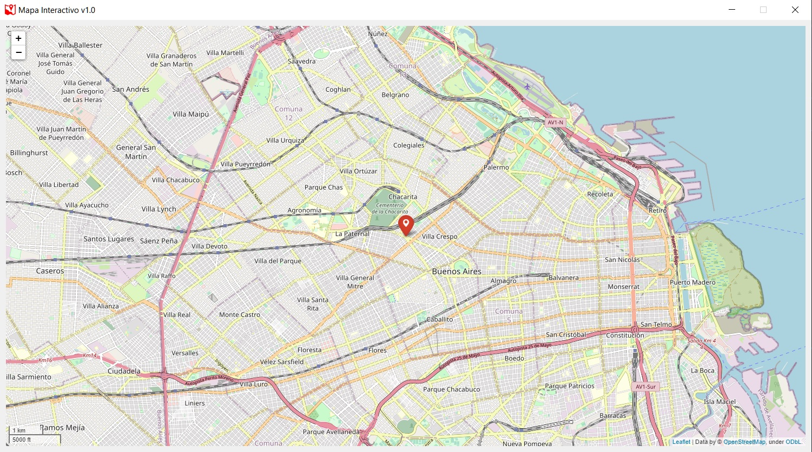
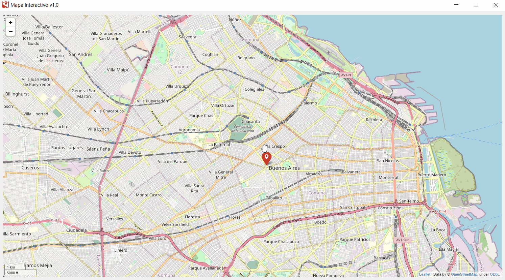
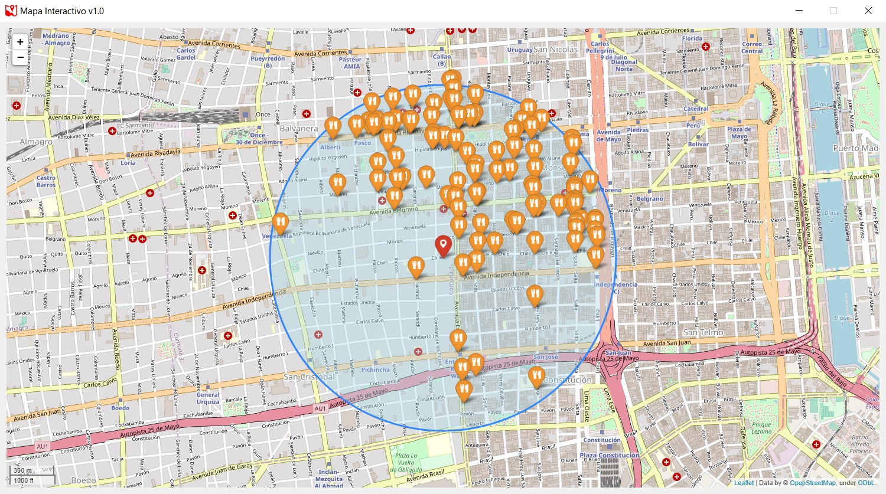

# Mapa Interactivo de CABA

---

Proyecto final realizado para la "Diplomatura en Python" de la [UTN](https://utn.edu.ar/es/).

El proyecto consta de dos aplicaciones realizadas segun el modelo MVC, por un lado tenemos una aplicacion de escritorio que cumple el rol de servidor y por el otro lado tenemos otra aplicacion que juega el papel de cliente con el cual podemos realizar consultas al servidor, el objetivo del proyecto es presentar al cliente ubicaciones geograficas de interes dentro de la Ciudad Autonoma de Buenos Aires, para esto se hace uso de [bases de datos](https://data.buenosaires.gob.ar/dataset/) que brinda publicamente el [Gobierno de la Ciudad de Buenos Aires](https://www.buenosaires.gob.ar), la presentacion de las ubicaciones se realizan sobre una interfaz grafica que cuenta con el mapa de dicha ciudad, brindando nombre y direccion del lugar buscado.

---

### Pre-requisitos  📋

* El proyecto fue desarrollado sobre [Python 3.9](https://www.python.org/downloads/release/python-390/) o superiores.
* Se utilizaron las siguientes librerias:
    - [PySide2](https://wiki.qt.io/Qt_for_Python) version 5.15.2 (ex-PyQT5)
    - [folium](https://python-visualization.github.io/folium/) version 0.12.1
    - [Jinja2](https://jinja.palletsprojects.com/en/3.0.x/) version 3.0.2
    - [pandas](https://pandas.pydata.org) version 1.3.4
    - [peewee](http://docs.peewee-orm.com/en/latest/) version 1.3.4
    
---

### Instalación 🔧

Procedemos a instalar los paquetes:

```
pip install PySide2
pip install folium
pip install Jinja2
pip install pandas
pip install peewee
```
---

## Ejecucion de servidor 🗄️

Ejecutamos un interprete de comandos, sobre Windows ejecutamos CMD, accedemos a la carpeta 'server' y ejecutamos el siguiente comando:

```
py server.py
```
Con esto logramos lanzar el servidor el cual queda esperando la conexion de un cliente.

---

## Ejecucion de cliente 👥

Antes de proceder a lanzar el cliente debemos asegurarnos de que haya un servidor escuchando, para lanzar el cliente debemos ,desde CMD, acceder a la carpeta 'client' y ejecutar el siguiente comando:

```
py controlador.py
```

Si todo funciona correctamente nos lanzara la siguiente interfaz grafica:



En el CMD lanzado nos pedira una direccion de correo valida al cual nos llegaran nuestras busquedas.

A continuacion nos dara dos opciones de busqueda:

    1) Por coordenadas
    2) Por barrios
    
1) Para conocer las coordenadas de una ubicación en concreto debemos arrastrar el marcador y clickear en él como se ve a continuación:



Una vez que tenemos las coordenadas las pegamos en el CMD y se nos habilitara un menu con opciones, por ejemplo aqui podemos ver todos los restaurantes cercanos a las coordenadas que le pasamos:



---

## Autores ✒️

* **María Angelica Inés Violi**
* **Alexander Daniel Ríos** - [A.R](https://github.com/aletbm)
* **Sasha Emanuel Franco** - [Olimpus](https://github.com/Armithael)
* **Tamara Ayelen Merchan** - [tmerchan](https://github.com/tmerchan)


```python

```
